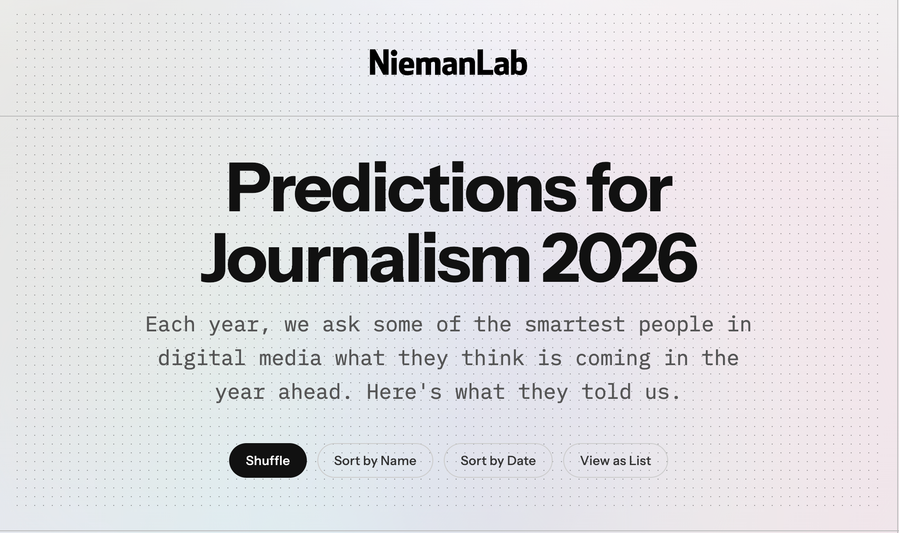
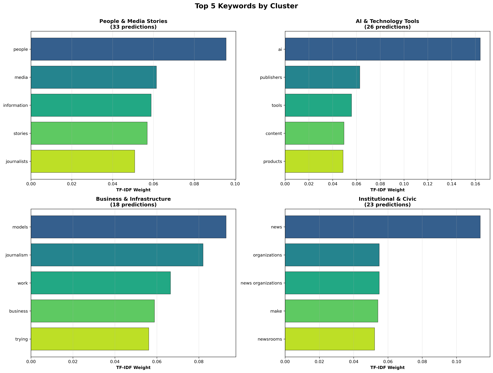

# NiemanLab 2026 Predictions: Cluster Analysis



**Research Question:** How do journalism experts frame the industry's future in the 2026 NiemanLab Predictions?

## Overview

This project analyzes 100 predictions from journalism experts using natural language processing to identify thematic clusters and determine whether the industry sees its future through a technological or humanistic lens.

**Key Finding:** Only 26% of predictions emphasize AI & technology. The remaining 74% focus on human relationships, business models, and institutional concerns. This suggests experts see journalism's future as primarily a **human challenge**, not a technological one.

## Method

- **Text Analysis:** TF-IDF vectorization
- **Clustering:** K-Means (k=4)
- **Visualization:** PCA dimensionality reduction

## Results

Four thematic clusters emerged:

| Cluster | Size | Focus | Keywords |
|---------|------|-------|----------|
| **People & Media Stories** | 33% | Human-centered | people, media, stories, journalists |
| **AI & Technology Tools** | 26% | Tech-focused | ai, publishers, tools, content |
| **Business & Infrastructure** | 18% | Economics | models, business, work, infrastructure |
| **Institutional & Civic** | 23% | Organizations | news, organizations, community |

## Clusters visualized



## Implications for Journalism in 2026 
The expert predictions mostly view the industry's future as primarily people-centered, but this doesn't diminish technology's role. Rather, it suggests a fundamental reframing; AI and digital tools are enablers, not replacements for human judgment and community connection.
The findings imply that while people remain at the forefront of journalism—building trust, fostering relationships, and exercising editorial judgment, technology will serve as critical infrastructure supporting these human-centered goals. AI might automate fact-checking or data analysis, but the expertise, empathy, and community engagement that define quality journalism remain distinctly human.

This perspective challenges the techno-deterministic narrative that has come to dominate media discourse. Instead of asking "How will AI replace journalists?",
industry leaders are asking "How can AI empower journalists to do more meaningful work?" The future they envision isn't humans versus machines but humans equipped with better tools to serve their communities more effectively.

## Quick Start

```bash
# Install dependencies
pip install -r requirements.txt

# Run analysis
jupyter notebook notebooks/nieman_analysis.ipynb
```

## Outputs

All visualizations and data exports are saved to `output/`:
- `cluster_scatter.png` - PCA visualization
- `cluster_keywords.png` - Top keywords per cluster
- `framing_analysis.png` - Tech vs human framing
- `predictions_clustered.csv` - Full dataset with cluster labels

## Data Source

Predictions from **NiemanLab's "Predictions for Journalism 2026"**, compiled by **[Nick Hagar](https://www.linkedin.com/in/nicholashagar/)** (Postdoc, Northwestern University) via [Google NotebookLM](https://lnkd.in/g9zy3Yip).

**Dataset:** Only 100 expert predictions analyzed out of 210

## Technologies

Python 3.8+ • pandas • scikit-learn • matplotlib • seaborn

---

**Author:** Emmanuel Maduneme
**Year:** 2025
